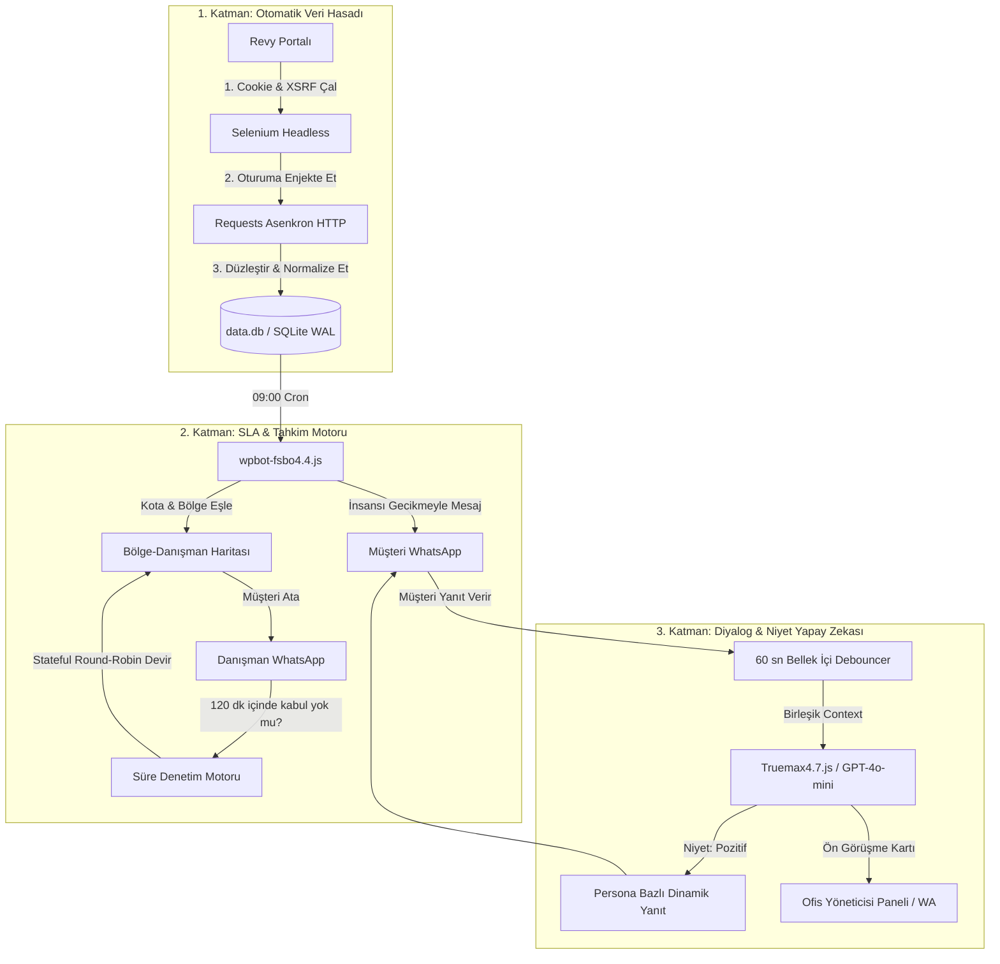
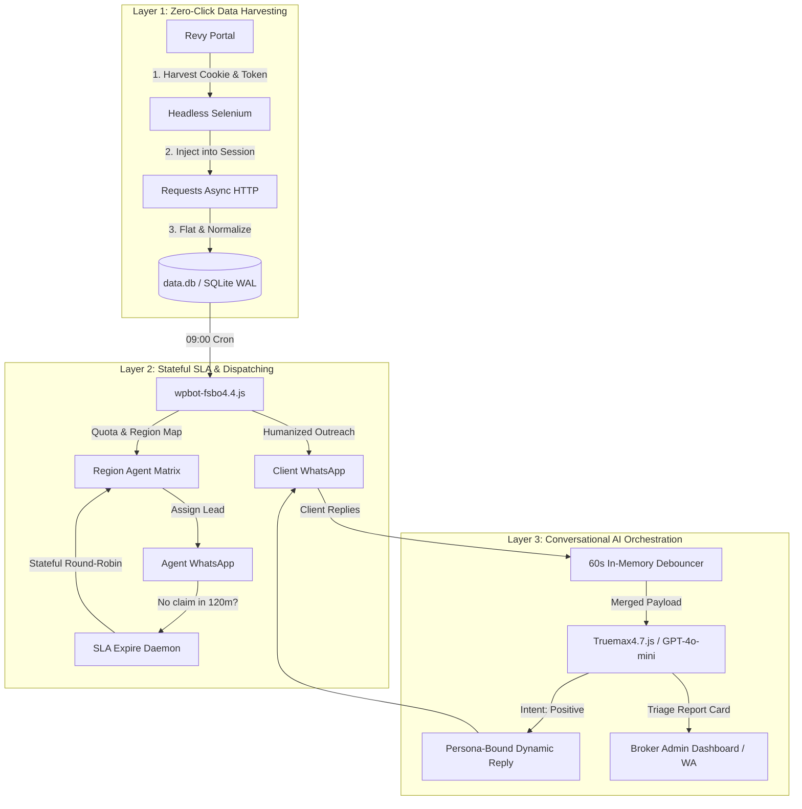

```markdown
# TrueMax – Autonomous Lead-to-Sale Real Estate & SLA Pipeline
**[🇹🇷 Türkçe](#-türkçe) | [🇬🇧 English](#-english)**

---

<a id="türkçe"></a>
# 🇹🇷 TrueMax – Otonom Gayrimenkul Satış & SLA Akış Hattı


> 🔒 **TİCARİ SIR & FİKRİ MÜLKİYET BİLDİRİMİ:**  
> *Bu B2B projesi aktif olarak sahada para basan ticari bir ürün olduğundan, kaynak kodun tamamı, otonom zamanlayıcılar ve dinamik debouncing algoritmaları **Gizli (Private) bir depoda** korunmaktadır. Bu depo, projenin sistem mimarisini ve üst düzey mühendislik yeteneklerini sergileyen bir **Teknik Vitrin (Whitepaper)** dosyasıdır. Doğrulanmış CTO'lar ve işverenler, canlı ekran paylaşımı ile kod incelemesi talep edebilir.*

---

## 🎯 Proje Özeti & Sahadaki Etkisi

**TrueMax**, RE/MAX True ofisi için tek başıma (Solo Developer) mimarisini kurup canlıya aldığım, kapalı döngü (closed-loop) bir otonom gayrimenkul müşteri kazanım ve tahkim sistemidir. 

Kimlik doğrulamalı (authenticated) iç portallardan sıfır-tıklama ile günlük mülk verilerini toplar, bu ilanları bölge danışmanlarına **katı SLA (Hizmet Seviyesi Taahhüdü) kurallarıyla** dağıtır (120 dakikalık kabul süresi = 7200 saniye) ve WhatsApp üzerinden yapay zeka destekli otonom ön görüşme (triage) gerçekleştirir.

* 📈 **Portföy Etkisi:** Ofisin aktif müşteri portföyünde **%60+ artış** sağladı.
* 💰 **Ciro Etkisi:** Toplam ofis gelirini **%40+ oranında** artırdı.
* ⚡ **Operasyonel Ölçek:** Günde 1.000'den fazla bölgesel mülk kaydını insan eli değmeden işler.

---

## 🏗️ Sistem Mimarisi



---

## ⚙️ Çekirdek Modüller

### 1. Veri Hasatçısı (`revybotcmd5.py`)

* **Görevi:** Bölgesel FSBO (Sahibinden Satılık/Kiralık) ilanlarının sıfır-tıklama ile veritabanına aktarılması.
* **Mühendislik Çözümü:** Hantal DOM kazıma (scraping) yükünden kaçınmak için Headless Firefox yalnızca oturum açıp taze `_hjSessionUser`, `XSRF-TOKEN` ve Cookie bilgilerini çalmak için kullanılır. Oturum yakalandıktan sonra tarayıcı kapatılır ve çok daha hızlı olan asenkron HTTP `requests.Session` üzerinden iç API sömürülür. Gelen karmaşık JSON ağacı `pandas.json_normalize` ile düzleştirilip SQLite tablosuna yazılır.

### 2. SLA Dağıtım & Tahkim Motoru (`wpbot-fsbo4.4.js`)

* **Görevi:** Coğrafi haritalama, kota yönetimi ve katı eskalasyon (escalation) denetimi.
* **Mühendislik Çözümü:** Yeni ilanları her danışmanın günlük kotasına (örn: max 200) ve bölge uzmanlığına göre eşleştirir. Mülk sahibine ilk kancayı atarken eşzamanlı olarak danışmana WhatsApp'tan kabul/red butonlu atama kartı gönderir.
* **SLA Eskalasyonu:** Danışmanlara **120 dakikalık katı bir kabul süresi** tanınır. Danışman bu sürede yanıt vermezse veya işlemi aksatırsa, arka plandaki `expireCheck` döngüsü atamayı iptal eder ve müşteriyi adil bir döngüyle (Stateful Round-Robin) sıradaki danışmana devreder (`passToNextConsultant`).

### 3. Diyalog & Niyet Orkestratörü (`Truemax4.7.js`)

* **Görevi:** Gelen mesajların filtrelenmesi, niyet analizi ve temsilci personasıyla otonom iletişim.
* **Mühendislik Çözümü:** WhatsApp kullanıcılarının kısa cümlelerle arka arkaya "Enter" tuşuna basma alışkanlığını yönetmek için her JID başına **60 saniyelik bellek içi (in-memory) bir debouncing havuzu** kurulmuştur (`userMessageBuffer`).
* Havuzda birleştirilen metin OpenAI `gpt-4o-mini` modeline beslenerek kullanıcının niyeti saptanır (`positive`, `negative`, `closed`, `spam`). Pozitif niyetlerde, mülkün bulunduğu bölge temsilcisinin veritabanındaki üslubuna (`tone`, `knowledge_scope`) bürünerek cevap üretilir ve ofis yöneticisine detaylı bir ön görüşme (triage) kartı iletilir.

---

## 🛠️ Öne Çıkan Mühendislik Paternleri

* **Anti-Spam Mesaj Birleştirme (Debouncing):** Gelen her mesaja anında LLM tetikleyip bütçeyi yakmak ve botu spama sokmak yerine, iletileri 60 saniye boyunca zaman damgasına göre kuyrukta bekletip tek bir bağlam (Context) olarak birleştirir. Bu sayede API maliyetlerinde ~%70 tasarruf sağlanmıştır.
* **Anti-Ban İnsansı Gecikme Mühendisliği:** Mesajlar robotik bir hızla iletilmez. Önce `sendSeen()` tetiklenir, metnin karakter uzunluğuna göre dinamik yazma süresi hesaplanır (`base = length * 300`) ve algoritmaları yanıltmak için araya rastgele matematiksel sapmalar (2.000ms -> 5.000ms Jitter) eklenir. Örneğin 50 karakterlik bir mesaj için dinamik bekleme süresi 17.000ms ile 20.000ms arasında salınır.
* **Sıfır Kilitlenme (WAL Concurrency):** İki Node.js botunun sürekli okuma/yazma yaptığı ve Python hasatçısının toplu veri bastığı anlarda veritabanının kilitlenmesini önlemek için tüm SQLite bağlantıları `PRAGMA journal_mode = WAL` (Write-Ahead Logging) modunda ve transaction bazlı çalıştırılır.

---

# 🇬🇧 TrueMax – Autonomous Lead-to-Sale Real Estate & SLA Pipeline

> 🔒 **PROPRIETARY INTELLECTUAL PROPERTY NOTICE:**
> *Because this system is an active, revenue-generating commercial product, the complete underlying backend execution code, browser-harvesting daemons, and dynamic debouncing algorithms are maintained in a strictly **Private Repository** to protect trade secrets. This repository serves as a **Technical Whitepaper & Architectural Showcase**. Verified CTOs and tech recruiters may request a live screen-share code walkthrough.*

---

## 🎯 Executive Summary & Commercial Impact

Engineered and solo-deployed by Bulut Emre Sakarya for the *RE/MAX True* office, **TrueMax** is a production-grade, closed-loop autonomous property acquisition and escalation engine.

It executes zero-click daily ingestion behind authenticated B2B portals, dynamically dispatches leads to regional real estate agents with **strict SLA enforcement** (120-minute claim window = 7,200 seconds), and triages incoming property owners via an intelligent WhatsApp AI orchestrator.

* 📈 **Portfolio Impact:** Directly increased the active office customer portfolio by **60%+**.
* 💰 **Revenue Impact:** Contributed to a **40%+ growth** in total firm revenue.
* ⚡ **Scale:** Autonomously ingests, maps, and triages 1,000+ regional properties daily.

---

## 🏗️ System Architecture



---

## ⚙️ Core Modules

### 1. The Harvester (`revybotcmd5.py`)

* **Mission:** Zero-click ingestion of regional FSBO (For Sale By Owner) listings.
* **Mechanics:** Bypasses heavy DOM-scraping overhead by spinning up a headless Firefox instance exclusively to harvest valid authentication cookies and `XSRF-TOKEN`s. Once harvested, the browser instance is terminated, and a lightweight HTTP session directly ingests raw JSON streams from internal APIs. Nested structures are flattened via `pandas.json_normalize` and securely committed to SQLite.

### 2. The SLA Dispatcher (`wpbot-fsbo4.4.js`)

* **Mission:** Geolocation mapping, daily quota management, and SLA enforcement.
* **Mechanics:** Evaluates daily incoming property leads against agent-specific limits (e.g., max 200 leads/day) and regional expertise matrices. Sends an initial outreach hook to the property owner while simultaneously alerting the assigned agent via interactive WhatsApp prompt cards.
* **The SLA Engine:** Enforces a strict **120-minute acceptance window**. If an agent fails to claim or update the lead, a scheduled worker marks the record as `expired` and re-allocates the customer to the next available agent via a custom stateful round-robin algorithm (`passToNextConsultant`).

### 3. The Conversational Orchestrator (`Truemax4.7.js`)

* **Mission:** Contextual triaging, intent classification, and persona-bound communication.
* **Mechanics:** Listens to incoming WhatsApp replies. To counteract the common user behavior of pressing "Enter" between short, fragmented thoughts, it routes incoming message streams into a **60-second in-memory debouncing buffer** (`userMessageBuffer`).
* Settled payloads are evaluated by `gpt-4o-mini` to determine user intent (`positive`, `negative`, `closed`, `spam`). Positive intents generate dynamic replies adhering strictly to the assigned regional agent's tone and knowledge scope, while simultaneously forwarding a structured triage report card to the brokerage manager.

---

## 🛠️ Engineering Highlights

* **Token & Rate Limit Debouncing:** Instead of firing an instant LLM request per incoming message fragment, the system buffers user turns per JID for 60 seconds. This single optimization reduced API token consumption by ~70% and completely eliminated Meta WhatsApp API rate-limit penalties.
* **Humanized Jitter Engineering:** Autonomous outreach messages avoid robotic execution. The system triggers `sendSeen()`, calculates dynamic typing durations based on string byte size (`base = length * 300`), and injects a randomized mathematical jitter (2,000ms -> 5,000ms) to flawlessly simulate human operators. For instance, a 50-character message yields a typing simulation delay ranging dynamically from 17,000ms to 20,000ms.
* **Zero-Deadlock Concurrency:** To support simultaneous reads from dual Node.js daemons and heavy bulk inserts from the Python harvester, all SQLite instances enforce `PRAGMA journal_mode = WAL` (Write-Ahead Logging) backed by exponential backoff retry wrappers.

---

## ✉️ Contact & Audits

*Architected and developed entirely as a solo proprietary B2B platform by **Bulut Emre Sakarya**.*

*For technical walkthrough requests, system audits, or workflow automation consulting, contact [sbulutemre@gmail.com](https://www.google.com/search?q=mailto%3Asbulutemre%40gmail.com).*

```


```
